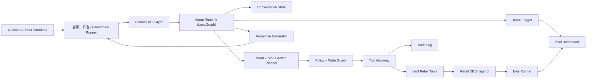
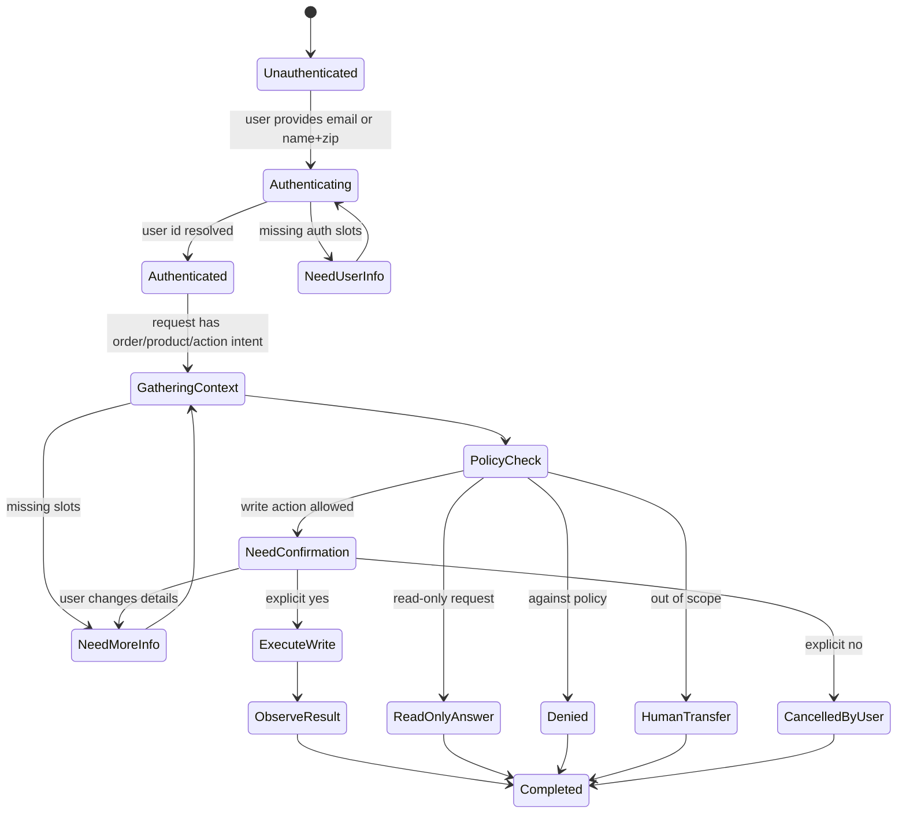

# Retail Customer Support Transaction Agent 技术架构设计

> ⚠️ **历史文档通知**
>
> 本文档是 v0.1 讨论稿（2026-06-10），**不代表当前实现**。
> 当前架构参考：
> - [`CLAUDE.md`](CLAUDE.md) — 项目约定、命令、架构概览
> - [`docs/portfolio-architecture.md`](docs/portfolio-architecture.md) — 架构设计决策
> - [`docs/design-audit.md`](docs/design-audit.md) — 架构审计报告
>
> 本文保留作为设计演进的历史参考，内容可能已过时。

**版本：** v0.1 讨论稿  
**日期：** 2026-06-10  
**定位：** 面向 AI Agent 工程师作品集的可评测交易型客服 Agent 工作台  
**主基线：** `AgentProject/data_sources/retail_customer_support_transaction_agent/current_tau3_bench`

---

## 1. 项目定位

`Retail Customer Support Transaction Agent` 不是普通客服问答机器人，而是一个面向电商售后场景的 **policy-constrained tool-using conversational agent**。

它要在多轮客服对话中完成：

- 用户身份核验
- 订单、商品、支付方式、库存状态查询
- 取消 pending 订单
- 修改 pending 订单地址、商品选项、支付方式
- 退货 delivered 订单商品
- 换货 delivered 订单商品
- 修改用户默认地址
- 超范围或不可处理场景转人工
- 记录完整 trace、工具调用、状态变更和评测结果

这个项目的核心价值不是“回答像客服”，而是：

> Agent 能在明确业务政策约束下正确调用工具，完成真实交易状态变更，并通过最终数据库状态和沟通结果进行硬评测。

---

## 2. 设计目标

### 2.1 工程目标

- 基于 tau3-bench retail 数据和 runtime 构建可运行 Agent。
- 用 LangGraph 或等价状态机表达 Agent 工作流，而不是把所有逻辑塞进单个 prompt。
- 对写操作建立独立 guard：schema 校验、policy 校验、用户确认、风险判断、幂等、审计。
- 建立 AgentOps 数据层：每次运行、每个步骤、每次工具调用、每次 policy check 都可回放。
- 支持离线评测：`pass^1`、`pass^k`、DB state accuracy、tool argument accuracy、mutation error rate。
- 支持前端客服工作台和 eval dashboard。

### 2.2 展示目标

该项目应重点展示：

- Agent workflow 编排能力
- Tool calling / function calling 能力
- 交易型写操作安全设计
- Policy verifier 和业务约束建模
- Eval 驱动开发
- Trace / observability / failure analysis
- Full-stack Agent 产品化能力

---

## 3. 数据与基线

### 3.1 主数据源

主基线使用：

```text
AgentProject/data_sources/retail_customer_support_transaction_agent/current_tau3_bench
```

核心 retail 文件：

```text
domains/retail/db.json
domains/retail/policy.md
domains/retail/tasks.json
domains/retail/split_tasks.json
runtime_retail/tools.py
runtime_retail/data_model.py
runtime_retail/environment.py
```

当前 retail 数据规模：

| 数据 | 数量 |
|---|---:|
| products | 50 |
| users | 500 |
| orders | 1000 |
| tasks | 114 |
| train tasks | 74 |
| test tasks | 40 |

### 3.2 当前工具范围

当前 runtime 已提供的 retail tools：

| 类型 | 工具 |
|---|---|
| 用户识别 | `find_user_id_by_email`, `find_user_id_by_name_zip` |
| 查询 | `get_user_details`, `get_order_details`, `get_product_details`, `get_item_details`, `list_all_product_types` |
| 计算 | `calculate` |
| 取消订单 | `cancel_pending_order` |
| 修改订单 | `modify_pending_order_address`, `modify_pending_order_items`, `modify_pending_order_payment` |
| 修改用户 | `modify_user_address` |
| 退货换货 | `return_delivered_order_items`, `exchange_delivered_order_items` |
| 转人工 | `transfer_to_human_agents` |

### 3.3 评测口径

当前 tau3-bench retail 的重点不是强制复刻 `evaluation_criteria.actions`，而是基于任务 `reward_basis` 评测结果。

需要注意本地材料存在版本口径差异：`docs/evaluation.md` 说明 airline / retail / telecom 默认使用 `DB + COMMUNICATE`；当前 `domains/retail/tasks.json` 中多数任务的 `reward_basis` 是 `DB + NL_ASSERTION`，少量是 `DB`；已下载的历史 result 文件里也可能保留运行时口径。项目实现和报告中应始终以实际 task 文件的 `reward_basis` 为准，并在结果报告中写明数据 commit、domain、split、agent、user simulator、model 和运行日期。

对架构设计来说，稳定目标是：

```text
Final DB state
Required communication / NL assertion when enabled by reward_basis
```

架构设计因此不应追求“固定脚本式工具路径”，而应追求：

- 最终业务状态正确
- 必要信息已告知用户
- 没有违反 policy
- 没有错误写操作
- 过程可追踪、可诊断

---

## 4. 核心业务约束

从 `policy.md` 和 `tools.py` 抽象出以下硬约束：

### 4.1 会话级约束

- 每个会话开始必须认证用户，方式是 email 或 name + zip。
- 即使用户直接提供 user id，也必须通过 email 或 name + zip 找到 user id。
- 一个会话只能服务一个用户。
- 认证后只能查询和操作该用户自己的订单、商品和资料。
- 每轮最多一个工具调用。
- 工具调用和自然语言回复不能在同一轮同时发生。

### 4.2 写操作约束

所有更新数据库的动作都必须：

```text
read-before-write
schema validation
policy check
action detail summary
explicit user confirmation
risk gate
idempotency key
audit log
```

### 4.3 订单状态约束

| 动作 | 允许状态 | 关键规则 |
|---|---|---|
| cancel order | `pending` | reason 只能是 `no longer needed` 或 `ordered by mistake` |
| modify address | pending-like | 只能修改 shipping address |
| modify payment | pending-like | 新支付方式必须不同；gift card 余额必须足够 |
| modify items | `pending` | 每个旧 item 只能换成同 product 的可用新 item；一次后状态变为 `pending (item modified)` |
| return items | `delivered` | 退款方式只能是原支付方式或 existing gift card |
| exchange items | `delivered` | 新 item 必须同 product 且 available；需要处理价差支付方式 |
| modify user address | authenticated user | 修改默认地址，不等于修改订单地址 |

### 4.4 转人工约束

只有两类场景应转人工：

- 用户明确要求人工客服。
- 用户诉求超出当前工具和 policy 能力范围。

转人工流程必须先调用：

```text
transfer_to_human_agents(summary)
```

然后向用户发送固定文案：

```text
YOU ARE BEING TRANSFERRED TO A HUMAN AGENT. PLEASE HOLD ON.
```

---

## 5. 总体架构

### 5.1 架构分层

```text
Frontend Workbench
  Customer Console / Agent Timeline / Order Panel / Eval Dashboard

API Layer
  FastAPI REST / WebSocket / Auth / Session API

Agent Runtime
  LangGraph workflow / state manager / planner / guard / response generator

Tool Gateway
  retail tools adapter / policy guard / idempotency / audit / error normalizer

Business Runtime
  tau3-bench retail env / simulated db / domain tools

Eval & Ops
  eval runner / metrics / trace replay / failure classifier

Storage
  MVP: SQLite or JSONL artifacts
  Later: PostgreSQL / Redis / object storage for traces and result snapshots
```

### 5.2 系统关系图



---

## 6. Agent 工作流设计

### 6.1 推荐 LangGraph 节点

```text
receive_message
-> conversation_gate
-> identity_resolver
-> intent_and_slot_extractor
-> context_loader
-> policy_reasoner
-> action_planner
-> write_action_guard
-> tool_executor
-> observation_reducer
-> response_generator
-> run_logger
```

### 6.2 节点职责

| 节点 | 是否 LLM | 职责 |
|---|---:|---|
| `receive_message` | 否 | 接收用户消息，追加 conversation state |
| `conversation_gate` | 否 | 会话级硬规则：是否已认证、是否跨用户、是否明显超出系统能力 |
| `identity_resolver` | 工具优先 | 用 email 或 name + zip 认证用户 |
| `intent_and_slot_extractor` | 是 | 抽取 intent、order id、item ids、目标选项、payment method、地址等 |
| `context_loader` | 否 | 根据 state 调用查询工具补齐订单、用户、商品上下文 |
| `policy_reasoner` | 是 + 规则 | 判断当前诉求是否符合 policy，输出 structured decision |
| `action_planner` | 是 | 决定下一步：追问、查询、确认、写操作、拒绝、转人工 |
| `write_action_guard` | 否为主 | 对写操作做硬校验，不允许 LLM 直接绕过 |
| `tool_executor` | 否 | 单次执行一个工具调用，记录结果和异常 |
| `observation_reducer` | 否/轻 LLM | 将工具结果归纳进 state，避免上下文膨胀 |
| `response_generator` | 是 | 生成面向用户的简洁客服回复 |
| `run_logger` | 否 | 记录 trace、cost、latency、tool call、state diff |

### 6.3 工作流状态机



### 6.4 Conversation State

建议使用 Pydantic 定义状态对象：

```text
ConversationState
  session_id
  task_id
  authenticated_user_id
  auth_method
  active_user_identity
  messages
  current_intent
  slots
  loaded_context
  pending_action
  confirmation_status
  policy_decision
  risk_level
  tool_results
  write_locks
  run_metrics
```

关键字段说明：

| 字段 | 说明 |
|---|---|
| `authenticated_user_id` | 当前会话唯一可服务用户 |
| `current_intent` | `cancel_order`, `return_items`, `exchange_items`, `modify_order`, `lookup`, `transfer` 等 |
| `slots` | order id、item ids、新 item ids、地址、支付方式、取消原因 |
| `loaded_context` | 已查询的 user、order、product、item、payment method |
| `pending_action` | 已通过 policy check、等待用户确认的写操作 |
| `confirmation_status` | `not_required`, `required`, `confirmed`, `denied`, `changed` |
| `write_locks` | 防止同一订单重复执行不可逆写操作 |

#### write_locks 互斥矩阵

`write_locks` 需要显式建模资源粒度和动作互斥关系，避免同一订单或同一 item 被重复改写。

锁 key 格式：

```text
{resource_type}:{resource_id}:{action_category}
```

常见资源：

```text
order:#W0000000:cancel
order:#W0000000:modify_items
order:#W0000000:modify_payment
order:#W0000000:modify_address
item:1008292230:return
item:1008292230:exchange
user:sara_doe_496:modify_address
```

互斥规则：

| 已有锁 | 阻止的新动作 | 原因 |
|---|---|---|
| `order:*:cancel` | 该订单所有写操作 | 订单已取消，不应继续修改 |
| `order:*:modify_items` | `cancel`, `modify_items` | 修改 item 后状态不再是纯 pending |
| `order:*:modify_payment` | 重复 `modify_payment` | 支付历史已变化，重复修改风险高 |
| `item:*:return` | 同 item 的 `return`, `exchange` | 同一 item 不能重复退换 |
| `item:*:exchange` | 同 item 的 `return`, `exchange` | 同一 item 不能重复退换 |
| `user:*:modify_address` | 重复完全相同参数的 `modify_address` | 幂等去重 |

注意：`modify_pending_order_address` 和 `modify_user_address` 是不同资源，不能混淆。

### 6.5 Conversation Gate 边界

`conversation_gate` 只处理会话级硬规则，不处理订单状态、退款方式、库存、商品 policy 等业务判断。

| 检查 | 处理 |
|---|---|
| 未认证用户提出业务请求 | 转到 `identity_resolver` |
| 用户试图操作其他用户资源 | 拒绝，并记录 `ownership_violation` |
| 请求明显超出系统能力，例如要求处理银行、航空、法律事务 | 转人工或拒绝 |
| 已认证用户提出订单/商品/退换货请求 | 放行到 `intent_and_slot_extractor` 和 `policy_reasoner` |

订单状态、商品库存、支付方式、退货/换货规则统一由 `policy_reasoner + write_action_guard` 处理。

### 6.6 Error Recovery & Edge Cases

| 场景 | 处理策略 | 失败标签 |
|---|---|---|
| LLM 返回 malformed JSON | 用 repair prompt 重试一次；仍失败则要求用户澄清或标记失败 | `json_parse_failure` |
| LLM 返回多个 tool calls | Tool Gateway 拒绝本轮，要求 planner 重新规划单个动作 | `tool_protocol_violation` |
| assistant 同轮同时返回 tool call 和自然语言 | Tool Gateway 拒绝用户可见内容，仅保留错误 trace | `tool_protocol_violation` |
| 工具调用超时 | 重试一次只读工具；写工具不自动重试，需幂等检查后人工/系统恢复 | `tool_timeout` |
| 工具执行异常 | 回滚或丢弃当前 runtime DB copy，返回可恢复错误给 planner | `tool_exception_not_recovered` |
| 用户在确认阶段改变主意 | 丢弃旧 `pending_action`，清理相关 confirmation state，重新进入 `NeedMoreInfo` | `confirmation_changed` |
| 用户拒绝确认 | 标记 `pending_action` 为 denied，不执行写操作 | `confirmation_denied` |
| `transfer_to_human_agents` 失败 | 重试一次；仍失败则返回人工转接失败说明并记录 incident | `handoff_failure` |
| 对话超过 max turns | 停止任务，记录 transcript 和最后 state | `timeout_or_max_steps` |
| 多轮循环重复同一追问 | loop detector 触发，要求 planner 生成替代追问或转人工 | `conversation_loop` |

---

## 7. Tool Gateway 设计

### 7.1 为什么需要 Tool Gateway

tau3 runtime tools 已经实现业务逻辑，但产品化 Agent 不能让 LLM 直接裸调用写工具。

Tool Gateway 负责：

- 工具 schema 注册
- 参数类型校验
- read/write 工具分级
- 写操作前置 policy guard
- 幂等 key 生成和重复调用检测
- 工具异常归一
- 工具调用日志和 state diff
- 对前端展示安全摘要

### 7.2 调用链路

```text
LLM proposed action
-> structured action schema
-> tool registry lookup
-> single-tool-per-turn validation
-> no-content-with-tool-call validation
-> argument validation
-> ownership validation
-> policy validation
-> confirmation validation
-> idempotency check
-> execute tau3 tool in isolated runtime DB
-> capture before/after DB hash
-> persist tool_call + audit_log
-> return normalized observation
```

Tool Gateway 必须把以下约束做成硬规则，而不是只写进 prompt：

- 一个 assistant turn 最多接受一个 tool call。
- 如果 assistant message 包含 tool call，则不能同时包含用户可见自然语言回复。
- tool result 进入下一轮后，才允许 `response_generator` 生成自然语言回复。
- 多工具调用、混合内容、未知工具、schema 不匹配都应被标记为 `tool_protocol_violation`。

### 7.3 写操作 Guard

建议把写操作 guard 做成确定性规则，不依赖 LLM 自觉遵守。

```text
WriteActionGuardResult
  allowed: bool
  block_reason?: string
  missing_requirements: string[]
  required_user_confirmation: bool
  risk_level: low | medium | high
  normalized_action?: ToolCall
  user_facing_summary?: string
```

典型拦截：

- 未认证用户就写库
- 订单不属于当前用户
- delivered 订单尝试 cancel
- pending 订单尝试 return
- item id 不在订单中
- new item 不属于同一 product
- gift card 余额不足
- 取消原因不在枚举内
- 未获得 explicit yes 就写库
- 同一订单重复调用一次性修改工具

运行隔离和事务要求：

- 每个 eval case 必须拥有独立 runtime DB copy，不能复用被其他 case 修改过的内存对象。
- 每次 replay 必须从同一个 initial DB snapshot 开始。
- 写工具执行前后记录 DB hash；工具异常时丢弃本次 runtime DB copy 或回滚到 before snapshot。
- CLI runner 中可用 deep copy / temp file snapshot；后续服务化时再切到事务型数据库。
- idempotency key 使用 `conversation_id + resource_type + resource_id + action_name + normalized_args_hash`，不能只依赖 `order_id`，因为 `modify_user_address` 这类写操作没有 order id。

### 7.4 ConfirmationResolver

写操作确认不应完全交给 LLM 自由判断。`ConfirmationResolver` 负责把用户确认/拒绝表达归一化：

```text
confirm:
  yes | yep | confirm | go ahead | proceed | ok | okay
  确认 | 可以 | 是的 | 好的 | 行 | 没问题 | 继续

deny:
  no | nope | cancel | stop | never mind
  不 | 不用 | 取消 | 算了 | 先不要 | 别改了

changed:
  用户提供新的 order/item/address/payment/reason 等关键信息

unknown:
  其他模糊表达，需要追问
```

处理规则：

- `confirm`：仅当 `pending_action` 仍然和当前 slots/context 一致时执行。
- `deny`：丢弃 `pending_action`，不执行写操作。
- `changed`：丢弃旧 `pending_action`，回到 slot/context 收集。
- `unknown`：追问用户是否确认执行已列明动作。

---

## 8. Policy Verifier 设计

### 8.1 分层策略

Policy verifier 不建议完全用 RAG + LLM 判断。更稳妥的方案是三层：

```text
Static Rules
  硬编码 order status、payment、ownership、confirmation 等不可妥协约束

Policy Retrieval
  从 policy.md 检索相关条款，作为 LLM reasoning context

LLM Policy Judge
  对复杂自然语言诉求做结构化判断，例如是否超范围、是否需要追问
```

### 8.2 输出结构

```text
PolicyDecision
  decision: allow | ask_clarification | deny | transfer
  intent
  required_slots
  missing_slots
  applicable_policy_sections
  constraints
  user_confirmation_required
  explanation_for_user
  internal_reasoning_summary
```

### 8.3 MVP 取舍

MVP 不必先做复杂向量 RAG。因为 retail policy 较短，可以：

- 把完整 `policy.md` 放进 system prompt。
- 将硬规则写进 `WriteActionGuard`。
- 只在后续扩展多 domain 或大规模 policy 时引入 `pgvector` / hybrid search。

---

## 9. 后端服务架构

### 9.1 技术栈

目标态推荐：

- Python 3.11+
- FastAPI
- Pydantic
- SQLAlchemy
- PostgreSQL
- pgvector
- Redis
- LangGraph
- Celery / RQ / Dramatiq
- DeepSeek API as default LLM provider
- Optional OpenAI / Anthropic / Gemini provider adapter for later A/B tests

MVP 不要求一次性启用完整目标态基础设施。第一版可以先用：

```text
CLI-first eval runner
FastAPI thin API
local artifact storage: JSONL / SQLite
DeepSeek provider
retail_adapter
LangGraph guarded workflow
```

PostgreSQL、Redis、Celery、object storage、pgvector 作为 Phase 4 生产化增强引入。

### 9.2 后端模块

```text
app/
  api/
    conversations.py
    agent_runs.py
    eval_runs.py
    traces.py
    datasets.py
  agent/
    graph.py
    state.py
    prompts.py
    planner.py
    policy_verifier.py
    write_guard.py
    response_generator.py
  tools/
    registry.py
    gateway.py
    retail_adapter.py
    schemas.py
  eval/
    runner.py
    metrics.py
    failure_classifier.py
    report.py
  ops/
    tracing.py
    audit.py
    cost.py
  db/
    models.py
    migrations/
```

### 9.3 API 设计

| API | 作用 |
|---|---|
| `POST /api/conversations` | 创建人工或 benchmark 会话 |
| `POST /api/conversations/{id}/messages` | 发送用户消息，触发 Agent 下一步 |
| `GET /api/conversations/{id}` | 获取会话状态 |
| `GET /api/agent-runs/{id}/trace` | 获取 Agent timeline |
| `POST /api/eval-runs` | 创建离线评测 |
| `GET /api/eval-runs/{id}` | 查看评测状态 |
| `GET /api/eval-runs/{id}/results` | 查看指标与失败样本 |
| `POST /api/tool-calls/{id}/replay` | 调试时重放工具调用 |
| `POST /api/human-approvals/{id}` | 人工审批高风险动作 |

### 9.4 DeepSeek LLM Provider

第一版默认使用 DeepSeek API。DeepSeek API 兼容 OpenAI / Anthropic API 格式，因此后端可以用 OpenAI SDK 接入，同时在代码层保留 `LLMProvider` 抽象，避免业务逻辑绑定到某一个 SDK。

推荐配置：

```text
DEEPSEEK_API_KEY=...
DEEPSEEK_BASE_URL=https://api.deepseek.com
DEEPSEEK_BETA_BASE_URL=https://api.deepseek.com/beta
DEFAULT_AGENT_MODEL=deepseek-v4-flash
REASONING_AGENT_MODEL=deepseek-v4-pro
```

模型选择：

| 用途 | 推荐模型 | 说明 |
|---|---|---|
| intent / slot / response | `deepseek-v4-flash` | 成本低，适合高频 Agent turn |
| policy reasoning / failure review | `deepseek-v4-pro` | 复杂判断、失败归因、评测复核 |
| 旧兼容名 | `deepseek-chat`, `deepseek-reasoner` | 官方文档显示这两个模型名将在 2026-07-24 15:59 UTC 废弃，项目不应以它们作为长期默认值 |

调用策略：

- 普通自然语言回复使用非 strict chat completion。
- intent / slot 抽取优先使用 JSON Output：`response_format={"type":"json_object"}`。
- 工具调用优先使用 DeepSeek tool calls。
- 写操作工具建议使用 strict function calling beta：`base_url="https://api.deepseek.com/beta"`，并在每个 function schema 里设置 `strict: true`。
- 即使使用 strict tool calls，后端仍必须执行 Pydantic schema validation、ownership validation、policy guard 和 user confirmation check。
- JSON Output prompt 必须显式包含 `json` 字样，并对空响应、截断响应、JSON parse failure 做重试。
- strict function calling beta 如果拒绝 schema，应降级到普通 tool calls + 后端 Pydantic 校验。
- 所有 DeepSeek 调用必须设置 timeout、max retries、rate limit backoff，并记录 `model`、`usage`、`finish_reason`、`reasoning_tokens`。
- 流式输出不是 MVP 必需项；如果后续启用 streaming，tool-call chunk 需要单独做 parser 和完整性校验。
- DeepSeek 特有行为，例如 JSON Output 必须包含 `json` 关键词、strict beta 降级逻辑、thinking 参数，应封装在 `DeepSeekProvider` 内部，不泄露到业务节点。

Provider adapter 建议接口：

```text
LLMProvider
  chat(messages, options) -> LLMMessage
  json(messages, schema, options) -> dict
  tool_call(messages, tools, options) -> ToolCall | AssistantMessage
  estimate_cost(usage, model) -> Cost
```

Provider 内部建议拆分：

```text
DeepSeekProvider
  build_json_prompt(...)
  normalize_tool_schema(...)
  call_strict_tool_beta(...)
  fallback_to_regular_tool_call(...)
  parse_usage(...)
  classify_provider_error(...)
```

DeepSeek 的 reasoning / thinking mode 可以作为可配置项：

```text
thinking: enabled | disabled
reasoning_effort: high | max
```

MVP 默认：

```text
planner: deepseek-v4-flash, thinking disabled
policy_reasoner: deepseek-v4-pro, thinking enabled
response_generator: deepseek-v4-flash, thinking disabled
failure_classifier: deepseek-v4-pro, thinking enabled
```

---

## 10. 数据库设计

### 10.1 核心表

本节是目标态数据模型。MVP 可先用 JSONL / SQLite 保存 trace 和 eval result，等 trace viewer / eval dashboard 稳定后再迁移到 PostgreSQL。

```text
conversations
messages
agent_runs
agent_steps
tool_calls
tool_observations
policy_checks
pending_actions
write_audit_logs
db_snapshots
eval_runs
eval_cases
eval_results
failure_labels
prompt_versions
model_versions
human_handoffs
human_approvals
```

### 10.2 表职责

| 表 | 职责 |
|---|---|
| `conversations` | 一次客服会话或一次 benchmark simulation |
| `messages` | 用户、assistant、tool 消息 |
| `agent_runs` | 一次 Agent 执行主记录，包含模型、prompt、成本、耗时 |
| `agent_steps` | LangGraph 节点级 trace |
| `tool_calls` | 工具名、参数、类型、调用状态 |
| `policy_checks` | policy decision、命中规则、拒绝原因 |
| `pending_actions` | 等待用户确认的写操作 |
| `write_audit_logs` | 写操作前后状态、DB hash、幂等 key |
| `eval_results` | 每个 task/trial 的 reward、DB match、failure reason |

### 10.3 关键索引

```text
conversations(task_id, created_at)
agent_runs(conversation_id, created_at)
tool_calls(agent_run_id, tool_name, status)
eval_results(eval_run_id, task_id, reward)
write_audit_logs(conversation_id, order_id, action_name)
```

---

## 11. 前端工作台设计

本节描述目标态。MVP 第一版只做 `trace viewer + eval dashboard`，完整客服工作台推迟到 Phase 4。

### 11.1 技术栈

推荐：

- React
- TypeScript
- TanStack Router
- TanStack Query
- TanStack Table
- Tailwind CSS 或现有设计系统
- Recharts / ECharts

### 11.2 核心页面

| 页面 | 作用 |
|---|---|
| Eval Dashboard | MVP：查看 pass rate、DB accuracy、成本、延迟 |
| Agent Trace Timeline | MVP：查看每轮 intent、policy、tool、response |
| Failure Analysis | MVP：按失败原因聚合样本 |
| Case Replay | MVP：回放失败样本 transcript、tool calls、state diff |
| Customer Support Console | Post-MVP：人工客服视角会话处理 |
| Order / User Inspector | Post-MVP：查看当前用户、订单、商品、支付方式 |
| Pending Action Review | Post-MVP：展示等待确认或人工审批的写操作 |
| Prompt / Model Version | Post-MVP：对比不同 prompt 和模型版本 |

### 11.3 客服工作台布局

```text
左侧：会话列表 / eval case 列表
中间：聊天窗口 + Agent 建议回复
右侧上：用户资料、订单详情、商品信息
右侧中：pending action、policy decision、风险提示
右侧下：tool calls、state diff、audit log
底部：trace timeline、成本、延迟、token
```

前端重点不是做营销页，而是做可操作、可调试、可回放的工作台。

---

## 12. Eval 体系

### 12.0 Eval Harness Contract

MVP 的 eval runner 先实现可复现、可回放的小规模 harness，不直接承诺完整 retail train/test split。

MVP task 范围：

```text
curated_mvp_subset
  覆盖认证、查询、取消订单、退货、换货、改地址、转人工
  暂时排除 modify_pending_order_payment 相关任务
  每类任务至少 2-3 个 case
```

完整 retail split 的前置条件：

- 所有 retail tools 都已被 `retail_adapter` 和 `WriteActionGuard` 覆盖，包括 `modify_pending_order_payment`。
- eval runner 支持每个 case 独立 DB snapshot。
- reward_basis 解析与官方 evaluator 口径一致。
- user simulator、max turns、seed、trial count 可配置并写入结果文件。

Harness 每个 case 的固定生命周期：

```text
load_task
-> create_isolated_db_snapshot
-> start_conversation
-> run_user_simulator_or_scripted_messages
-> run_agent_until_stop_or_limit
-> persist_trace
-> compute_db_hash
-> run_reward_basis_checks
-> classify_failure
-> export_replay_artifact
```

结果文件必须包含：

```text
eval_run_id
dataset_commit
domain
split_or_subset
task_id
trial
seed
agent_strategy
model_config
max_turns
termination_reason
reward_basis
reward
db_match
tool_protocol_violations
failure_label
trace_artifact_path
```

### 12.0.1 User Simulator 策略

MVP 先支持 scripted user messages，避免一开始把 Agent 失败和 user simulator 随机性混在一起。

```text
Phase 0-2:
  scripted_user
  固定消息序列
  固定 max_turns
  固定 seed 字段但不依赖随机生成

Phase 3+:
  tau3 user simulator adapter
  或 DeepSeek-based user simulator
  simulator_model、simulator_seed、temperature 写入 eval result
```

User simulator 约束：

- simulator 不能泄露 task gold actions。
- simulator 只能逐步披露 scenario 中允许的信息。
- simulator 的 seed 必须和 Agent seed 分开记录。
- 如果 simulator 产生 out-of-scope 或自相矛盾信息，应标记为 `simulator_error`，不归因给 Agent。

### 12.0.2 Prompt 版本策略

MVP 采用文件化 prompt + 手动版本号：

```text
prompts/
  agent_system_v001.md
  planner_v001.md
  policy_reasoner_v001.md
  response_generator_v001.md
  failure_classifier_v001.md
```

每次 agent run 必须记录：

```text
prompt_version_id
prompt_file
prompt_sha256
model
model_params
dataset_commit
code_commit_or_run_id
```

Baseline 对比时只允许一次改变一个主要变量，例如 model、prompt、workflow、guard。

### 12.1 官方对齐指标

| 指标 | 说明 |
|---|---|
| `pass^1` | 单次运行任务是否成功 |
| `pass^k` | 同一任务 k 次是否全部或稳定成功 |
| `Final DB State Accuracy` | 最终 DB hash 是否匹配 gold |
| `Communicate / NL Assertion` | 必要信息是否正确传达 |

### 12.2 自定义诊断指标

| 指标 | 说明 |
|---|---|
| `Tool Call Success Rate` | 工具调用是否成功执行 |
| `Tool Argument Accuracy` | 参数是否符合 gold 或业务约束 |
| `Mutation Error Rate` | 错误写库率 |
| `Policy Violation Rate` | 违反 policy 的比例 |
| `Confirmation Compliance Rate` | 写操作前是否明确确认 |
| `Ownership Violation Rate` | 是否操作了其他用户资源 |
| `Escalation Precision / Recall` | 转人工是否恰当 |
| `Average Turns Per Resolution` | 平均完成轮数 |
| `Cost Per Task` | 每个任务 LLM 成本 |
| `Latency Per Task` | 端到端耗时 |

### 12.3 失败归因

失败原因建议归类为：

```text
auth_failure
intent_misclassification
slot_missing_not_asked
wrong_order_selected
wrong_item_selected
policy_reasoning_error
confirmation_error
wrong_tool
wrong_tool_arguments
tool_exception_not_recovered
incorrect_user_message
unnecessary_handoff
missing_handoff
timeout_or_max_steps
```

### 12.4 Baseline 对比

建议至少实现四组，区分“编排收益”和“Guard 收益”：

| Baseline | 说明 |
|---|---|
| Naive Tool Agent | 单 prompt + tool calling |
| ReAct Agent | 参考 current_tau3_bench `examples_agents/react_agent.py` |
| Unguarded LangGraph Agent | LangGraph workflow，但不启用 WriteActionGuard |
| Guarded Workflow Agent | 本项目主实现：LangGraph + policy verifier + write guard |

对照矩阵：

| | 单 Prompt | LangGraph |
|---|---|---|
| 无 Guard | Naive Tool Agent | Unguarded LangGraph Agent |
| 有 Guard | 暂不作为 MVP 必需 | Guarded Workflow Agent |

对比维度：

```text
pass^1
pass^k
DB accuracy
policy violation rate
mutation error rate
tool argument accuracy
avg turns
cost
latency
```

---

## 13. 安全与合规设计

### 13.1 写操作安全

- 所有写工具默认必须经过 `pending_action -> explicit yes -> execute`。
- 写操作必须记录 before/after DB hash。
- 对同一个 `conversation_id + resource_type + resource_id + action_name + normalized_args_hash` 生成 idempotency key。
- 不可逆或一次性动作必须加 `write_locks`，例如 `modify_pending_order_items`、`exchange_delivered_order_items`。
- 任何 guard block 都应返回用户可理解的解释，而不是暴露内部错误。

### 13.2 Prompt Injection 防护

用户消息不得覆盖：

- retail policy
- tool schema
- 当前认证用户
- 写操作确认规则
- 单轮单工具调用规则

可实现：

```text
instruction hierarchy
structured planner output
tool gateway hard checks
policy decision audit
unsafe instruction detector
```

### 13.3 隐私与访问控制

- 会话只能访问 authenticated user 的数据。
- 前端只展示当前会话相关用户和订单。
- trace 中可对邮箱、地址、支付方式做脱敏展示。
- 审计日志保留原始参数，但权限受控。

---

## 14. MVP 范围

### 14.0 已确认 MVP 决策

| 决策项 | 结论 |
|---|---|
| 第一版前端 | 先做 `eval dashboard + trace viewer`，不先做完整客服工作台 |
| Harness / Eval Runner | 保留，并作为项目亮点：case runner、trace replay、failure analysis |
| DeepSeek 模型策略 | 主链路用 `deepseek-v4-flash`；复杂 policy review / failure review 用 `deepseek-v4-pro` |
| tau3 runtime 复用 | MVP 先通过 `retail_adapter` 复用 `runtime_retail/tools.py`；后续再逐步替换成自建 service |

### 14.1 MVP 必做

第一版建议只做 text retail，不做 voice 和多 domain。

MVP 包含：

```text
FastAPI thin API or CLI-first runner
Retail adapter for runtime_retail/tools.py
LangGraph guarded workflow
Identity resolver
Intent + slot extractor
Policy verifier v1
Write action guard
Trace logger
Eval runner for curated_mvp_subset
Trace viewer
Eval dashboard
Failure analysis report
```

MVP 支持的任务：

- 查询订单 / 商品 / 用户资料
- 取消 pending order
- 修改 pending order address
- 退货 delivered order
- 换货 delivered order
- 转人工

MVP 暂不承诺覆盖：

- `modify_pending_order_payment`
- 全量 train/test retail split
- 所有复杂 item modification 组合

### 14.2 MVP 暂不做

- voice tasks
- telecom / airline 多 domain
- 复杂 RAG 向量检索
- 真实支付或物流系统接入
- 多智能体协作
- 微调模型
- 真实企业 ROI 指标
- PostgreSQL / Redis / Celery / object storage 的完整生产部署
- 完整客服工作台
- Prompt / Model Version 管理页
- Human approval 工作流
- Multi-provider A/B testing
- MCP 封装
- full DB snapshot 持久化

---

## 15. 迭代路线

### Phase 0：基线复现

- 跑通 current tau3-bench retail 环境。
- 跑通 minimal / ReAct example agent。
- 能生成本地 eval result。
- 解析 result JSON，得到 pass rate、成本、延迟。
- 确认 DeepSeek API 接入，主链路使用 `deepseek-v4-flash`。

### Phase 1：Guarded Workflow Agent

- 实现 LangGraph 状态机。
- 实现 identity resolver、slot extractor、context loader。
- 实现 deterministic write guard。
- 通过 `retail_adapter` 接入 `runtime_retail/tools.py`。
- 记录 trace。

### Phase 2：Eval & Failure Analysis

- 批量运行 `curated_mvp_subset`。
- 实现 pass^1、pass^k、DB accuracy、tool error metrics。
- 对失败样本自动打标签。
- 使用 `deepseek-v4-pro` 做复杂 failure review / policy review。
- 输出模型和 prompt 版本对比报告。

### Phase 3：Trace Viewer + Eval Dashboard

- 构建 trace timeline。
- 构建 eval dashboard。
- 支持失败样本回放。
- 暂不做完整客服工作台，只保留最小会话查看和调试能力。

### Phase 4：产品化增强

- 构建完整客服工作台。
- 补齐 `modify_pending_order_payment` 和复杂 modify items 场景。
- 开始运行完整 retail train/test split。
- 引入 PostgreSQL / Redis / Celery / object storage。
- 加入 human-in-the-loop 审批。
- 引入 policy chunking / RAG。
- 支持多 provider 模型对比。
- 支持 MCP server 封装 retail tools。
- 扩展到 voice 或 telecom domain。

---

## 16. 关键技术取舍

### 16.1 LangGraph vs 单 Prompt Agent

推荐 LangGraph。

原因：

- 多轮状态明确。
- 写操作可在图节点中硬拦截。
- 失败恢复路径可控。
- trace 更容易映射到节点。
- 简历展示更能体现 Agent engineering 能力。

### 16.2 Policy RAG 是否 MVP 必要

MVP 不必先上向量 RAG。

原因：

- retail policy 当前较短，可以完整放入上下文。
- 关键约束应由代码 guard 硬实现。
- 过早引入 RAG 会增加调试变量。

后续扩展多 domain 或更长 policy 时再引入 hybrid search。

### 16.3 是否需要人工审批

MVP 可以先实现“转人工”和“pending action 审核 UI”，不一定真的让人工改写 DB。

建议第二阶段加入：

- 高风险写操作人工确认
- policy 例外人工处理
- 低置信度 intent 人工接管

### 16.4 是否追榜

不建议主打 SOTA。

更适合主打工程对比：

```text
Naive Tool Agent
-> ReAct Agent
-> Guarded Workflow Agent
```

然后证明 guard workflow 在 mutation error、policy violation、pass stability 上更稳。

---

## 17. 已确认决策与延期项

### 17.1 已确认决策

| 问题 | 决策 |
|---|---|
| 第一版前端做什么 | 先做 `eval dashboard + trace viewer` |
| 是否体现 harness | 保留，作为 `eval runner + case runner + trace replay + failure analysis` |
| DeepSeek 模型策略 | 主 Agent 用 `deepseek-v4-flash`；policy / failure review 用 `deepseek-v4-pro` |
| tau3 runtime 复用程度 | MVP 先通过 `retail_adapter` 复用 `runtime_retail/tools.py` |
| benchmark runner 形态 | MVP 先做 CLI-first runner；后续再接 FastAPI async job |
| confirmation 识别 | 使用 `ConfirmationResolver` 归一化英文和中文确认/拒绝/变更表达 |
| MVP eval 范围 | 使用 `curated_mvp_subset`，不直接跑完整 retail train/test split |
| DB snapshot 策略 | MVP 保存 DB hash + state diff；失败样本保存 replay artifact |

### 17.2 延期项

这些不阻塞 MVP，但需要在后续 Phase 明确：

1. `modify_pending_order_payment` 放在 Phase 4，除非 curated cases 提前需要支付修改能力。
2. 完整 PostgreSQL / Redis / Celery / object storage 在 Phase 4 生产化时引入。
3. 完整客服工作台、human approval、MCP、多 provider A/B testing 均放在 Phase 4+。
4. 若要对齐官方 leaderboard，需要在完整 split 前确认 user simulator、seed、trial count 和 evaluator 口径。

---

## 18. 推荐下一步

建议按下面顺序推进：

1. 先跑通 tau3-bench retail example agent，确认本地环境、DeepSeek key、eval runner 可用。
2. 实现 `retail_adapter` 和最小 `RetailToolGateway`，包装当前 `runtime_retail/tools.py`。
3. 实现 `ConversationState`、`conversation_gate`、`WriteActionGuard`、`ConfirmationResolver`，先覆盖 cancel、return、exchange。
4. 做 CLI-first eval runner，使用 `curated_mvp_subset`，确保每个 case 独立 DB snapshot。
5. 对比 naive、ReAct、Unguarded LangGraph、Guarded Workflow 四组 baseline。
6. 再做 trace viewer、eval dashboard 和 case replay。

当前设计的核心原则：

> LLM 负责理解用户意图、补齐槽位和生成自然语言；代码负责身份、权限、policy hard rules、写操作安全和评测可追踪性。

---

## 附录 A：架构评审记录

> 状态说明：A.3-A.5 中合理建议已合并到正文，包括 `conversation_gate`、`write_locks` 互斥矩阵、Error Recovery、Unguarded LangGraph baseline、User Simulator 策略、Prompt 版本策略、ConfirmationResolver 和 DeepSeek provider quirks 封装。本附录保留为评审记录。

### A.1 评审信息

| 项目 | 内容 |
|---|---|
| 评审文档版本 | v0.1 讨论稿 |
| 评审日期 | 2026-06-10 |
| 评审重点 | 技术架构设计（非需求总纲） |
| 评审结论 | **可进入 Phase 0 实现，4 个问题建议定稿前修正，3 个缺口在后续 Phase 中补齐** |

---

### A.2 架构质量——做得对的地方

#### A.2.1 定位清晰且全程不跑偏

文档从 §1 到 §18 围绕三个锚点展开：**Policy constraint**（§4/§8/§7.3）、**Tool-using**（§6/§7）、**Hard evaluation**（§12/§3.3）。没有退化成「更好的客服 Chatbot」设计。核心价值主张——「Agent 在明确业务政策约束下正确调用工具，完成真实交易状态变更，并通过最终数据库状态和沟通结果进行硬评测」——在每个架构决策中都得到了体现。

#### A.2.2 LLM / 代码职责边界切割清晰

| 节点 | LLM？ | 关键决策权 |
|---|---|---|
| `intent_and_slot_extractor` | 是 | 允许推理，输出 structured slot map |
| `policy_reasoner` | 是 + 规则 | LLM 搭配 Static Rules 硬拦截 |
| `write_action_guard` | **否为主** | 拒绝 LLM 绕过 |
| `response_generator` | 是 | 只负责自然语言 |

LLM 能理解的部分让它理解，LLM 能搞砸的部分（权限、状态检查、幂等）用代码锁死。这是实际 Agent 工程中最关键的决策。

#### A.2.3 Tool Gateway 调用链路具体且可审查

§7.2 的 14 步调用链路每一步都是可测试的检查点。校验顺序经过设计——先做便宜的检查（registry lookup、参数校验），再做需要查数据的检查（ownership、policy），最后做不可逆操作。早期低成本拦截错误请求。

另外，`single-tool-per-turn` 和 `no-content-with-tool-call` 从「prompt 建议」升级为「Tool Gateway 硬拦截」——这在实战中非常重要，因为 LLM 偶尔会违反这些约定。

#### A.2.4 Policy Verifier 三层设计避免了过度工程化

§8.1 的 Static Rules → Policy Retrieval → LLM Policy Judge 三层策略务实。MVP 明确不做向量 RAG，因为 retail policy 够短，可直接注入 prompt。过早引入 RAG 会显著增加 eval 调试复杂度。

#### A.2.5 评测体系不追求「固定脚本式路径」

§3.3 明确声明只评测 Final DB State + Communication，不评测中间步骤路径。这避免了 Agent 评测中常见的反模式：把 eval 变成 pattern match，Agent 背下 gold path 才能通过。

#### A.2.6 MVP 范围收得够紧

§14 砍掉了完整客服工作台、`modify_pending_order_payment`、PostgreSQL/Redis/Celery/pgvector 全套基础设施、MCP 封装、Human approval 工作流、Multi-provider A/B testing。但保留了 LangGraph guarded workflow + 六种任务 + CLI eval runner + trace viewer + eval dashboard + 三个 baseline 对比。范围控制在 4-6 周可交付。

#### A.2.7 Eval Harness 契约定义到位

§12.0 新增的 Eval Harness Contract：每个 case 独立 DB snapshot、固定 6 步生命周期、结果文件必须包含 15 个字段（从 `dataset_commit` 到 `trace_artifact_path`）。eval 结果可复现、可审计——这是 Agent 项目在面试中最有力的证据。

---

### A.3 问题与风险——建议定稿前修正

#### A.3.1 `session_policy_check` 和 `policy_reasoner` 职责边界模糊

**现状**：`session_policy_check` 职责含「是否需要拒绝」，`policy_reasoner` 职责含「判断当前诉求是否符合 policy」。语义重叠。例如用户要求退一个 pending 订单——由谁拒绝？

**建议**：将 `session_policy_check` 重命名为 `conversation_gate`，职责限定为三条纯规则检查（无需 LLM）：

1. 当前会话是否已认证？→ 否 → redirect to `identity_resolver`
2. 当前用户是否在操作其他用户的资源？→ 是 → deny
3. 当前请求是否明显超出系统能力（如"帮我给银行打电话"）→ 是 → transfer

凡涉及订单状态、商品库存、退款方式、政策条款的判断，统一由 `policy_reasoner` 处理。

**优先级**：P0（定稿前修正，一个子节即可）

---

#### A.3.2 `write_locks` 缺少具体互斥矩阵

**现状**：§6.4 提到 `write_locks`「防止同一订单重复执行不可逆写操作」，但没有明确锁的粒度和互斥规则。

**建议**：补充以下语义说明：

```text
write_locks key 格式：
  {order_id}:{action_category}

action_category 枚举：
  cancel | modify_items | modify_address | modify_payment | return | exchange

互斥规则：
  - lock("cancel", order_123) 阻止该 order 的所有写操作
  - lock("modify_items", order_123) 阻止该 order 的 modify_items 和 cancel
    （modify_items 后状态变为 pending (item modified)，不再是 pending）
  - lock("return", order_123, item_456) 阻止同一 item 的重复 return
  - lock 的粒度对 exchange 是 item 级，对 cancel 是 order 级
```

锁的粒度直接影响 §13.1 idempotency key 的 `resource_type` 取值，需要统一。

**优先级**：P0（定稿前修正）

---

#### A.3.3 缺少错误恢复路径的系统设计

**现状**：状态机图（§6.3）、失败归因列表（§12.3）多处提到失败，但以下 recovery 路径均未覆盖：

| 失败场景 | 当前文档是否有策略？ |
|---|---|
| LLM 返回 malformed JSON（slot extractor 输出坏掉） | ❌ 只在 §9.4 提到「重试」，没有具体 repair 流程 |
| 工具调用超时 | ❌ 未提及 |
| 用户在确认阶段改变主意（`yes` → `no, I want to return a different item`） | 状态机有 `NeedConfirmation → NeedMoreInfo`，但没有说明旧的 `pending_action` 是 discard 还是保留 |
| `transfer_to_human_agents` 调用本身失败 | ❌ 未提及 |
| 同一 case 运行到第 8 轮完全偏离主题 | ❌ 未提及 max turns gate 或 loop detection |

**建议**：在 §6 工作流设计中新增子节 `6.5 Error Recovery & Edge Cases`，用表格式覆盖上述场景。

**优先级**：P1（Phase 1 实现前补齐）

---

#### A.3.4 Baseline 对比缺少关键对照组——Unguarded LangGraph Agent

**现状**：§12.4 三个 baseline：

```text
Naive Tool Agent → ReAct Agent → Guarded Workflow Agent
```

问题：Guarded Workflow Agent 同时换了两个变量——LangGraph 编排 + Write Guard。无法区分「编排收益」和「Guard 收益」。

**建议**：增加第四组 `Unguarded LangGraph Agent`（LangGraph 工作流 + 无 write guard），使对比矩阵完整：

| | 单 Prompt | LangGraph |
|---|---|---|
| **无 Guard** | Naive | Unguarded WF |
| **有 Guard** | — | Guarded WF |

**优先级**：P1（Phase 2 eval 前加入）

---

### A.4 架构缺口——后续 Phase 中补齐

#### A.4.1 缺少 User Simulator 的设计

tau3-bench 的 eval 依赖 user simulator。文档提到 `run_user_simulator_or_scripted_messages`（§12.0），但没有说明：

- 使用 tau3-bench 自带 simulator 还是自建？
- 如果是自建，用什么模型？是否需要 guard？（simulator 也可能产生不合理请求）
- simulator 的 seed 如何与 Agent 的 seed 隔离？

User simulator 的行为直接影响 Agent 评测指标，建议在 Phase 1 eval runner 实现前明确。

**优先级**：P2（Phase 1 实现时处理）

---

#### A.4.2 缺少 Prompt 管理策略

文档多处提到 prompt（§9.4、§8.3、§16.4），但没有说明 prompt 如何版本化管理：

- System prompt 硬编码在代码里还是从文件/template 加载？
- Prompt 版本如何与 model 版本配对追踪？
- Baseline 对比时如何确保 prompt 是唯一变量？

建议 MVP 采用最简方案：

```text
MVP：prompt 文本和 prompt_version_id 存入 agent_runs 表。
每次改动 prompt 时手动更新 version id，与 commit hash 关联。
```

**优先级**：P2（Phase 1 实现时处理）

---

#### A.4.3 「确认」机制的国际化与 benchmark 对齐策略

§17.2 问题 2 仍 open：confirmation 是否接受中文表达？

这不是细节。如果 Agent 要求 confirm 但用户说了「确认」而 Agent 不识别，整个 case 失败。

**建议**：在 `WriteActionGuard` 或 `action_planner` 中定义 `ConfirmationResolver`，用规则归一化用户确认表达：

```text
匹配 "yes" | "yep" | "confirm" | "go ahead" | "确认" | "可以" | "是的" | "好的" | "行"
拒绝 "no" | "nope" | "cancel" | "算了" | "不用了" | "取消"
其他 → 追问用户
```

**优先级**：P1（Phase 1 实现 confirmation 逻辑时处理）

---

### A.5 LLM Provider 容错策略补充建议

§9.4 的 DeepSeek 调用策略在工程实践中需注意：

- **strict function calling beta**：beta 端点行为可能变化甚至下线。依赖 beta 功能构建核心链路是风险。
- **降级逻辑**：从 strict 降级到普通 tool calls 时需要明确定义触发条件（HTTP 4xx？JSON 解析失败？schema mismatch？）。
- **JSON Output 的 `json` 关键词**：这是 DeepSeek 特有要求，在 `LLMProvider` adapter 切换 provider 时可能变成隐蔽 bug。

**建议**：将 provider-specific quirks（DeepSeek 的 `json` 关键词、strict 降级逻辑）封装在 adapter 内部，不泄露到业务代码和 prompt 中。

**优先级**：P2（Phase 1 LLMProvider 实现时处理）

---

### A.6 评审总结

**文档定级**：Implementation-Ready Architecture —— 离代码开工只差一个仓库初始化。每节有具体的取舍、字段、API 路由、调用链路节点数。

**定稿前必须修正（P0）**：
1. `session_policy_check` / `policy_reasoner` 职责切分（§6.2）
2. `write_locks` 互斥矩阵补充（§6.4 / §13.1）

**Phase 1 实现前补齐（P1）**：
3. 错误恢复路径表格式覆盖（新增 §6.5）
4. Baseline 加 Unguarded LangGraph 对照组（§12.4）
5. ConfirmationResolver 归一化规则（关联 §17.2 问题 2）

**Phase 1 实现时处理（P2）**：
6. User Simulator 设计
7. Prompt 版本化管理方案
8. LLMProvider adapter 封装 provider-specific quirks

**核心优势**：LLM 和代码的职责边界是这份架构最亮的设计决策。它不会因为追求「智能」而把安全检查交给不可靠的 LLM，也不会因为追求「安全」而把用户意图理解写成正则表达式。这个平衡是 Agent 工程的核心竞争力。
