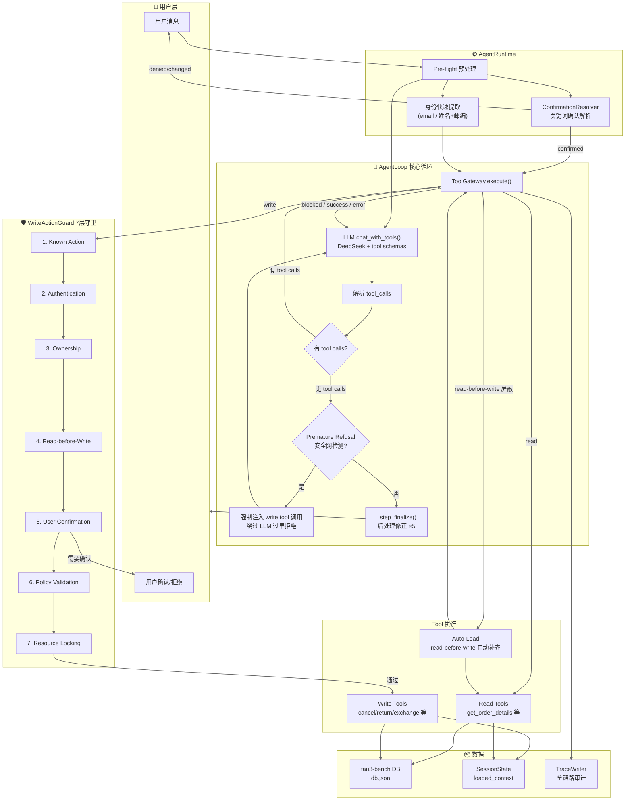
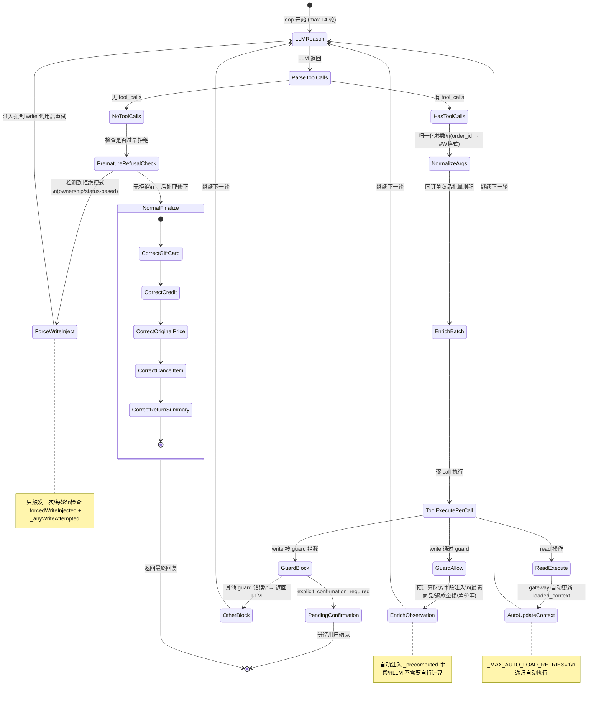
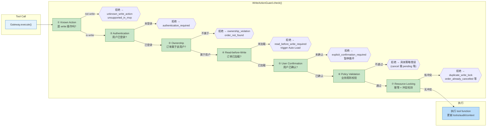
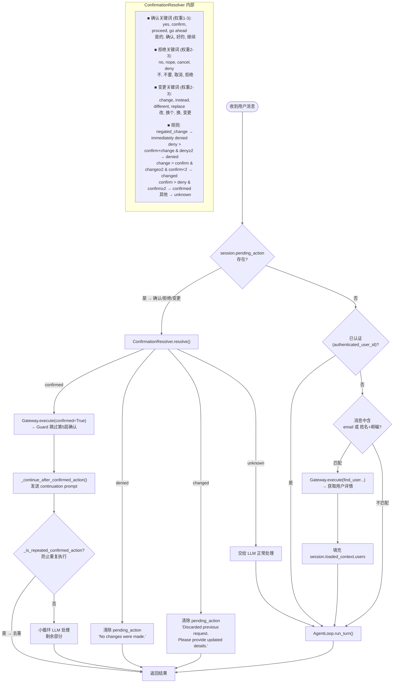
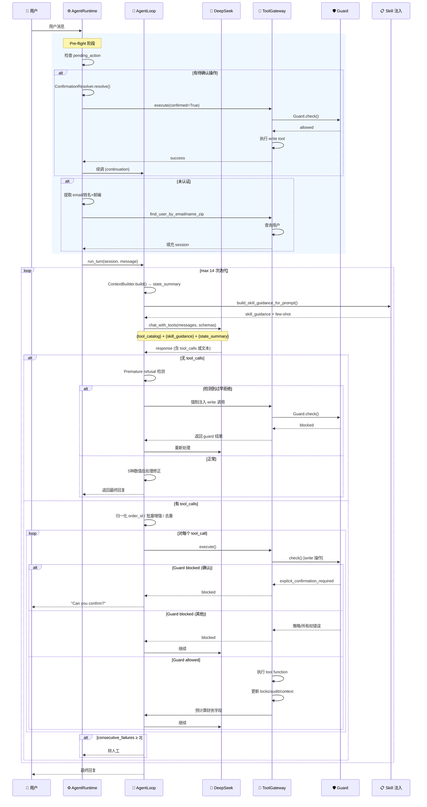

# AgentLoop Mermaid 图解

> 本文件包含 AgentLoop 完整流程的 Mermaid 图表，可直接在 GitHub、GitLab 或任意支持 Mermaid 的 Markdown 预览中渲染。

---

## 1. 整体架构概览



---

## 2. AgentLoop 内循环状态机 (核心)



---

## 3. 7层 Guard 守卫流程



---

## 4. Pre-flight + 确认解析流程



---

## 5. 完整时序交互



---

## 6. 关键数据流总结

```
用户消息
    │
    ├─ agent/runtime.py ── preflight
    │   ├─ pending_action → ConfirmationResolver → 确认/拒绝/变更 → 直接执行
    │   └─ 未认证 → regex 提取 → find_user → 填充 loaded_context
    │
    └─ agent/llm_agent.py ── AgentLoop.run_turn()
           │
           │  System Prompt = llm_agent_system_v001.md
           │    + {tool_catalog}   ← tools/registry.py
           │    + {policy}         ← config
           │    + {state_summary}  ← context_builder.py (每轮动态)
           │    + {skill_guidance} ← skills/registry.py (8 skills)
           │
           └── loop (max 14):
                  ├─ LLM → tool_calls?
                  │   ├─ 无 → Premature Refusal 检测
                  │   │   ├─ 是 → 强制注入 write → 重试
                  │   │   └─ 否 → 5种数值修正 → 返回
                  │   └─ 有 → ToolGateway.execute() → Guard (7层)
                  │       ├─ write 通过 → 执行 → 财务字段预计算
                  │       ├─ write 被拦截 → 确认/策略/所有权错误
                  │       └─ read 通过 → 自动更新 loaded_context
                  │
                  └── 终止条件:
                       ├─ LLM 无 tool_calls + 无拒绝检测 → 正常返回
                       ├─ Guard 要求确认 → 暂停等待用户
                       ├─ 14 轮满 → 转人工
                       └─ 连续 3 次失败 → 转人工
```
