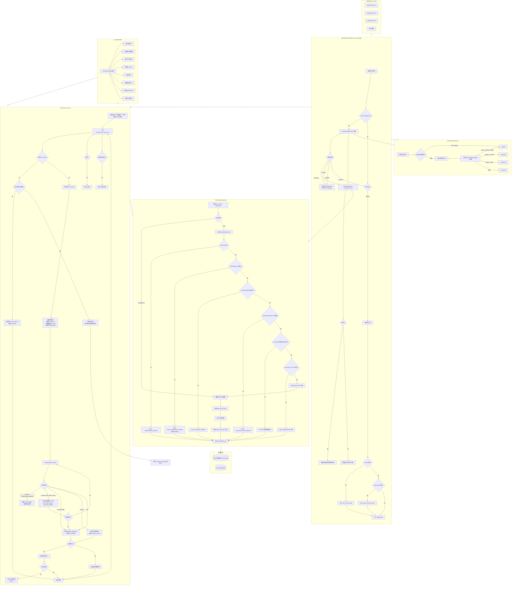

# 数据流文档

> 从用户输入到最终响应的完整数据流，覆盖所有安全层和逻辑分支。



## 逻辑流程概述

### 1. 用户输入进入 `AgentRuntime.handle_user_message()`

这是所有入口（CLI、Workbench API、测试）的统一入口点。

### 2. 预检查（Pre-flight）

| 步骤 | 逻辑 | 路由 |
|------|------|------|
| **PendingAction 检查** | 如果 `session.pending_action` 存在，调用 `ConfirmationResolver` 解析用户回复 | 确认→直接执行；拒绝/变更→丢弃；未知→继续 LLM |
| **身份认证** | 如果未认证，尝试从消息中提取 email 或 name+zip 自动认证 | 成功→加载用户上下文；失败→LLM 会提示用户提供信息 |

### 3. AgentLoop：LLM 工具调用循环

系统提示由三部分组成：`核心契约 + 具体任务提示 + 动态状态摘要`。LLM 收到工具 Schema 后决定调用哪些工具。

**关键设计模式**：LLM 负责调用写工具——Guard 层负责决策是否允许。即使 LLM 觉得操作会失败，也必须调用写工具。

**安全网**：如果 LLM 过早拒绝（不调用写工具直接回复文本），`_detect_premature_refusal` 会检测并强制注入一个写工具调用。

### 4. ToolGateway：执行与 Guard 检查

| 层 | 检查项 | 阻断时 |
|----|--------|--------|
| 1. 认证 | `authenticated_user_id` 是否设置 | "authentication_required" |
| 2. 显式确认 | `confirmed=True` 标志 | "explicit_confirmation_required" → 设置 PendingAction |
| 3. 所有权 | 订单/资源的 owner 是否匹配 | "ownership_violation" |
| 4. 读前写 | 订单/用户是否已在 loaded_context | "read_before_write_required" → 自动加载重试 |
| 5. 策略 | 订单状态、商品可用性、支付方式、余额 | 具体错误码（如 "non_pending_order_cannot_be_cancelled"） |
| 6. 资源锁 | 同资源是否有冲突写操作 | "duplicate_write_lock" |
| 7. 幂等性 | 基于 session+tool+args+lock 的哈希 | 内部使用，防止重复执行 |

### 5. 确认流程（用户侧的交互）

```
LLM 调用 write tool → Guard 要求确认 → 设置 PendingAction → 
Assistant 返回 "Can you confirm?" → 用户回复 →
ConfirmationResolver 解析 → 确认则执行, 拒绝则丢弃
```

### 6. 响应生成

- 如果无工具调用且无过早拒绝→最终化阶段
- 如果写操作成功确认→可选的"继续剩余请求"的二次 LLM 调用
- 如果全部失败→终止策略（连续失败限制、最大迭代限制）

### 7. 追踪与评估

每次运行的完整记录（状态变化、工具调用、LLM 响应、Guard 阻断）保存为 Trace 产物，用于后续评估和 Workbench AgentOps 可视化。
